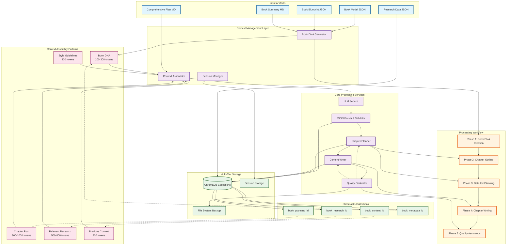

```mermaid
graph TB
    %% Input Layer
    subgraph "Input Artifacts"
        A1[Book Model JSON]
        A2[Book Blueprint JSON]
        A3[Book Summary MD]
        A4[Comprehensive Plan MD]
        A5[Research Data JSON]
    end

    %% Processing Layer
    subgraph "Context Management Layer"
        B1[Book DNA Generator]
        B2[Context Assembler]
        B3[Session Manager]
    end

    %% Core Services
    subgraph "Core Processing Services"
        C1[LLM Service]
        C2[JSON Parser & Validator]
        C3[Chapter Planner]
        C4[Content Writer]
        C5[Quality Controller]
    end

    %% Storage Layer
    subgraph "Multi-Tier Storage"
        D1[(ChromaDB Collections)]
        D2[Session Storage]
        D3[File System Backup]
    end

    %% ChromaDB Details
    subgraph "ChromaDB Collections"
        E1[book_research_id]
        E2[book_planning_id]
        E3[book_content_id]
        E4[book_metadata_id]
    end

    %% Workflow Phases
    subgraph "Processing Workflow"
        F1[Phase 1: Book DNA Creation]
        F2[Phase 2: Chapter Outline]
        F3[Phase 3: Detailed Planning]
        F4[Phase 4: Chapter Writing]
        F5[Phase 5: Quality Assurance]
    end

    %% Context Assembly Strategy
    subgraph "Context Assembly Patterns"
        G1[Book DNA<br/>200-300 tokens]
        G2[Chapter Plan<br/>800-1000 tokens]
        G3[Relevant Research<br/>500-800 tokens]
        G4[Style Guidelines<br/>300 tokens]
        G5[Previous Context<br/>200 tokens]
    end

    %% Connections - Input to Processing
    A1 --> B1
    A2 --> B1
    A3 --> B1
    A4 --> B2
    A5 --> D1

    %% Context Management
    B1 --> G1
    B2 --> C1
    B3 --> D2

    %% Core Processing Flow
    C1 --> C2
    C2 --> C3
    C3 --> C4
    C4 --> C5

    %% Storage Connections
    C2 --> D1
    C3 --> D1
    C4 --> D1
    C5 --> D3

    %% ChromaDB Collections
    D1 --> E1
    D1 --> E2
    D1 --> E3
    D1 --> E4

    %% Workflow Progression
    F1 --> F2
    F2 --> F3
    F3 --> F4
    F4 --> F5

    %% Context Assembly
    G1 --> B2
    G2 --> B2
    G3 --> B2
    G4 --> B2
    G5 --> B2

    %% Phase Integration
    B1 --> F1
    C3 --> F2
    C3 --> F3
    C4 --> F4
    C5 --> F5

    %% Retrieval Patterns
    E1 -.-> G3
    E2 -.-> G2
    E3 -.-> G5
    E4 -.-> G1

    %% Quality Feedback Loop
    C5 -.-> C3
    C5 -.-> C4

    %% Styling
    classDef inputClass fill:#e1f5fe,stroke:#01579b,stroke-width:2px
    classDef processClass fill:#f3e5f5,stroke:#4a148c,stroke-width:2px
    classDef storageClass fill:#e8f5e8,stroke:#1b5e20,stroke-width:2px
    classDef workflowClass fill:#fff3e0,stroke:#e65100,stroke-width:2px
    classDef contextClass fill:#fce4ec,stroke:#880e4f,stroke-width:2px

    class A1,A2,A3,A4,A5 inputClass
    class B1,B2,B3,C1,C2,C3,C4,C5 processClass
    class D1,D2,D3,E1,E2,E3,E4 storageClass
    class F1,F2,F3,F4,F5 workflowClass
    class G1,G2,G3,G4,G5 contextClass
```