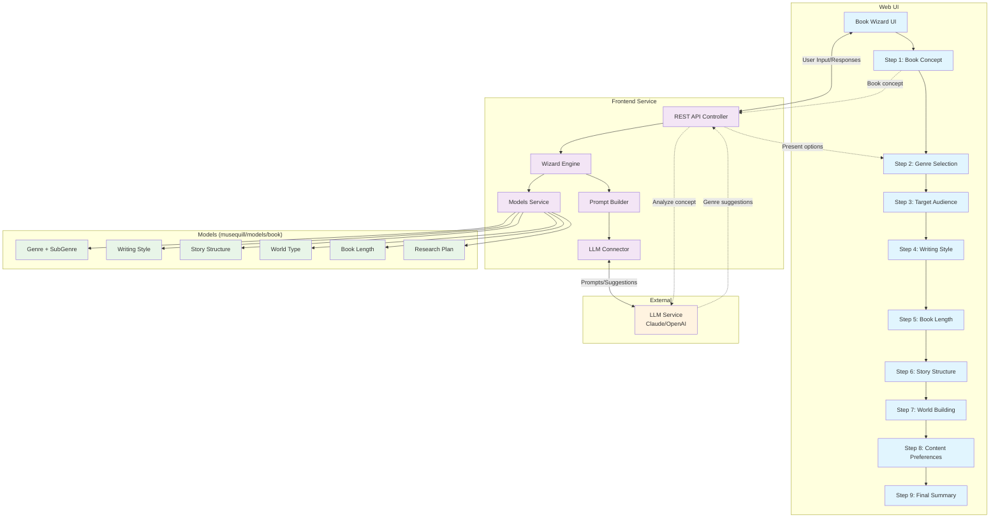

```mermaid
graph TB
    %% User Interface Layer
    subgraph "Web UI"
        UI[Book Wizard UI]
        Step1[Step 1: Book Concept]
        Step2[Step 2: Genre Selection]
        Step3[Step 3: Target Audience]
        Step4[Step 4: Writing Style]
        Step5[Step 5: Book Length]
        Step6[Step 6: Story Structure]
        Step7[Step 7: World Building]
        Step8[Step 8: Content Preferences]
        Step9[Step 9: Final Summary]
        
        UI --> Step1
        Step1 --> Step2
        Step2 --> Step3
        Step3 --> Step4
        Step4 --> Step5
        Step5 --> Step6
        Step6 --> Step7
        Step7 --> Step8
        Step8 --> Step9
    end

    %% Frontend Service Layer
    subgraph "Frontend Service"
        API[REST API Controller]
        WizardEngine[Wizard Engine]
        ModelService[Models Service]
        PromptBuilder[Prompt Builder]
        LLMConnector[LLM Connector]
        
        API --> WizardEngine
        WizardEngine --> ModelService
        WizardEngine --> PromptBuilder
        PromptBuilder --> LLMConnector
    end

    %% Models Layer
    subgraph "Models (musequill/models/book)"
        GenreModel[Genre + SubGenre]
        StyleModel[Writing Style]
        StructureModel[Story Structure]
        WorldModel[World Type]
        LengthModel[Book Length]
        ResearchModel[Research Plan]
        
        ModelService --> GenreModel
        ModelService --> StyleModel
        ModelService --> StructureModel
        ModelService --> WorldModel
        ModelService --> LengthModel
        ModelService --> ResearchModel
    end

    %% External Services
    subgraph "External"
        LLM[LLM Service<br/>Claude/OpenAI]
    end

    %% Data Flow
    UI <-->|User Input/Responses| API
    LLMConnector <-->|Prompts/Suggestions| LLM
    
    %% Step Flow Example
    Step1 -.->|"Book concept"| API
    API -.->|"Analyze concept"| LLM
    LLM -.->|"Genre suggestions"| API
    API -.->|"Present options"| Step2

    %% Styling
    classDef uiLayer fill:#e1f5fe
    classDef serviceLayer fill:#f3e5f5
    classDef modelLayer fill:#e8f5e8
    classDef external fill:#fff3e0
    
    class UI,Step1,Step2,Step3,Step4,Step5,Step6,Step7,Step8,Step9 uiLayer
    class API,WizardEngine,ModelService,PromptBuilder,LLMConnector serviceLayer
    class GenreModel,StyleModel,StructureModel,WorldModel,LengthModel,ResearchModel modelLayer
    class LLM external

```